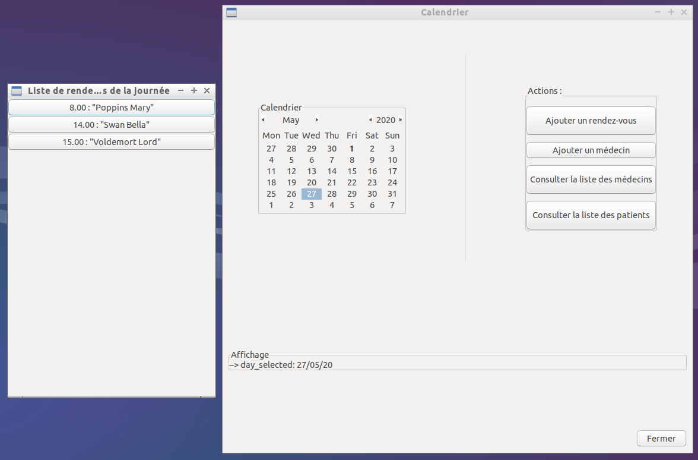
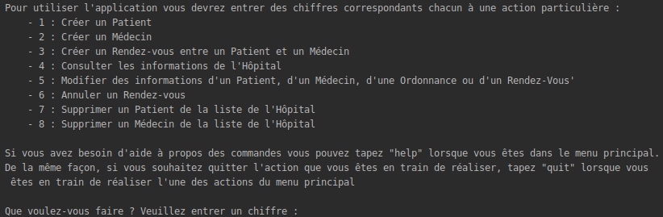

# 								GPCalendar

GPCalendar is an application allowing physician in a structure like an hospital to manage easily their timetable. It is still under development. It also allows better communication between patient and physician with easy access to personal data, easy use of the historical of consultations, etc.

## Features

#### Managing Patient / Physician

With **GPCalendar** or **GPCalendar_Shell** you can create **Patient** and **Physician** accounts with plenty of their personal and professional information (as phone number, mail address or **social Security number** / **RPPS number** which allow us to identify Patients and Physician).

#### Creating Appointments in the Hospital Calendar

In order to create **RendezVous** between a Patient and a Physician, they have to be registered in your project before creating the appointment. And then you have to select a date and a time slot for your **RendezVous**. If among the Patient, the Physician or the place of your **RendezVous** is already busy during this time slot you get a warning message and you will have to shift your appointment.

#### Cancelling an appointment (Only in **GPCalendar_Shell**)

If you want to cancel a **RendezVous** already registered you will be able to do it only in **GPCalendar_Shell** (we didn't have the time to finish implementing this and the following features in the GTK3+ interface).

So, to cancel a **GPCalendar_Shell**, you have to know its date and time slot, and you can't cancel an appointment which has already happened. 

#### Editing particular Hospital information (Only in **GPCalendar_Shell**)

**GPCalendar_Shell** allows you to edit every information of your **GPCalendar_Project** (except your Patient's **social Security number** and Physician's **RPPS number**). To do so, you simply have to follow the instructions displayed by **GPCalendar_Shell**.

#### Deleting a Patient / Physician (Only in **GPCalendar_Shell**)

If you want to delete a Patient or a Physician from your hospital database you can only do it in **GPCalendar_Shell**. And take care, those actions will delete absolutely every trace of your Patient or Physician (namely, every appointment he had, his presence from the list of **received Patient** / **consulted Physician** in the professional informations of everyone else in the database, and obviously all of his information.)

#### Saving / Loading one of your project

Available in **GPCalendar** and in **GPCalendar_Shell** this features allow you to easily keep versions of the state of your cabinet / hospital. This features will save your data in **.json** files (which are extremely well readable text files) and then you will be able to manage your saved projects as you wish.

## GPCalendar (main executable)

If you run the `./GPCalendar` executable you will be able to use the main features of our application.

With **GTK3+**, the first window opening allows you to select whether you prefer loading a project or creating a new one. 

It then opens the main window, with the calendar and the command buttons :



On this interface, you can :

- Select a day to see which appointments are taken on this day and with whom ;

- Open the list of all practitioners and see their information ;
- Open the list of all patients and see their information ;
- Add a practitioner to the project ;
- Add an appointment (and a patient) to the calendar.

When closing the project, you can choose whether you want to discard or save the changes you made.

## GPCalendar_Shell

**GPCalendar** is an application which has a graphical interface (generated with GTK3+).

But, if you don't have GTK3+ or don't want to use it (understandable), you can also use **GPCalendar** in a shell (by running `./GPCalendar_Shell`). You will have to enter numbers to choose what action you want to do :

```bash
case 1 :
	Create a Patient
case 2 :
	Create a Medecin
case 3 :
	Create a RendezVous beetween a Patient and a Physician
case 4 : 
	Check Hospital Data (Working Physician, consulting Patient, Calendar)
case 5 :
	Edit Hospital Informations (Patient, Physician, Order, RendezVous)
case 6 : 
	Cancel a RendezVous
case 7 :
	Delete a Patient
case 8 :
	Delete a Physician
```

**GPCalendar_Shell** contains more features than **GPCalendar** because we didn't have time to complete **GPCalendar** API with **GTK3+**. It looks like this :



## Build

**GPCalendar** is a cross platform application, built with **CMake**.

To build the application, make sure you have **CMake** and clone the git repertory. Then create the source build folder and access it :

````bash
git clone https://gitlab.insa-rennes.fr/cleonard/C_Project.git
cd C_Project && mkdir build && cd build
````

You can now run the **CMake** commands to build the project

````bash
cmake ..
cmake --build .
````

If you are especially using `CodeBlocks`, you can generate a CodeBlocks project with :

````bash
cmake -G "CodeBlocks - Unix Makefiles" .
````

(You can also see what other type of project you can build with **CMake** with `cmake -G`).

## CMake

If you don't have **CMake** you can run the following commands (Credits **OlivierLdff**) :

````bash
sudo apt-get install libssl-dev
wget https://github.com/Kitware/CMake/releases/download/v3.17.0-rc2/cmake-3.17.0-rc2.tar.gz
tar zxvf cmake-3.17.0-rc2.tar.gz
cd cmake-3.17.0-rc2
./configure
make -j2	#You can also run make without -j or -j2 but it will be slower
sudo make install
# Restart terminal
````

## Unit-Testing & CodeCoverage

Unit-tests are implemented only in the Model in the **tests_unitaires.c** file. You can run it by executing the `GPCalendar_Shell` executable : 

````bash
cd build
./GPCalendar_Shell
````

If you want to see the **code coverage** on the Model (with **GPCalendar_Tests**), first make sure you have installed `lcov`, if you haven't , run :

````bash
sudo apt-get install lcov
````

Then, go to your build directory 

````bash
cd build
````

And then run the following commands :

````bash
cmake -DCMAKE_BUILD_TYPE=Coverage ..
make
make GPCalendar_coverage
````

The percentage of Code Coverage will appear. If you want further information you can open the .html file : **index.html** in the directory build/coverage

## Saving or Loading Project with cJSON

**cJSON** is a GitHub Project which allows to easily use the **JSON** format in C code. It is used to "Save" and "Load" the application. Don't worry about downloading it, everything is managed in our **CMakeLists.txt**.

If you want to save or load one of your project, you have to enter the path (including the name of the file you want to load or save) of the file you want to create to save your project (or load).

Example : - Load : ```C:\Documents\YourProject.json```

​				  - Save : ```C:\Documents\NameOfMySavedFile.json```

## Doxygen

A documentation is provided for the different functions of our project, thanks to `Doxygen`, in the file **index.html** in the directory ```Doxygen/html```.

If you want to create or update the documentation, first make sure you have installed Doxygen :
````bash
sudo apt-get install doxygen
````
Then, run the command
````bash
doxywizard
````
A setup window will open where you'll be able to configure the documentation of your project. When the configuration is done, you can find your documentation in the file **index.html**.


## GTK3+

### General Settings for CMake

GTK3+ isn't build with CMake like `CMocka` or `cJSON`, it's built with `meson`. Therefore it isn't possible to just fetch content of the GTK3+ git project in our **CMakeLists.txt** and then normally build the project.

Also, to include GTK3+ in the project you have to download his libraries first :

````bash
sudo apt install libgtk-3-dev
````

You want the dev library. Be careful, the name of the package may have changed. But you're looking for something like `libgtk-3`, `libgtk3.0` or `libgtk3-dev`.

Once it's done, be sure you have `PkgConfig` (it's a package manager that we are using in our **CMakeLists.txt**) :

````bash
sudo apt install pkg-config
````

And then you can normally run CMake (in your build repertory) with :

````bash
cmake ..
cmake --build .
````

As the GTK3+ dependences are only include in `./GPCalendar` you can use the application with `./GPCalendar_Shell` (or test it with `./GPCalendar_Tests` or `./GPCalendar_coverage`) without having GTK3+.


### Manually Settings for CodeBlocks

#### Installation

GTK+ has been mostly conceived for Linux. Therefore, if you do not have it, I invite you to check out the openclassroom course on how to create a GTK+ interface on MacOs or Windows.
But If you have Linux, let's begin:

First you should download the different libraries. To do so, open your Linux shell and type:
````bash
sudo apt-get update
````
This allows you to update your different packages. Then you'll need to install the *devpackages* and make sure you do have the runtime so type:
````bash
sudo apt-get install libgtk-3-dev
````

#### How to build with your console
Open your Linux shell for instance and go to your folder:
````bash
cd /home/the_path_to_your_folder/
````
Then you'll have to build your code doing:
````bash
gcc $(pkg-config --libs --cflags gtk+-3.0) main.c -o executable_name
````
The main.c corresponds to the name of our file (source code of the program) and executable_name is the name you want to give to your program.
Finally you need to run it:

````bash
./executable_name
````

#### How to build with your IDE
I will show you now how to use and configure the Code :: Blocks software which is a portable, open source IDE and very practical for GTK+.

First, launch Code :: Blocks and open or create a new Project by going to: *File -> New Project -> Empty project*
Then you'll need to configure your compiler. Go to Project -> Build Options select the debug mode and select the compiler settings and in  *"add in other options"* type:

````bash
`pkg-config --cflags gtk+-3.0`
````
You'll have to do the same with the linker settings:
````bash
`pkg-config --libs gtk+-3.0`
````
Repeat these two lines for the Release and Projectname mode (usually at the top left of the window).
